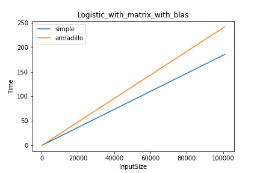

### Benchmarking Activation-Functions
#### Running the Benchmarks

Run the following command on terminal (This has only been tested on OSX, Use appropriate commands for your OS.)
`./run.sh`

If you face issue while running the above script, Kindly run commands in ./run.sh manually.

Results are stored in two csv files(one with and without BLAS) and inference images are stored in results
folder.
Some results are shown below:

